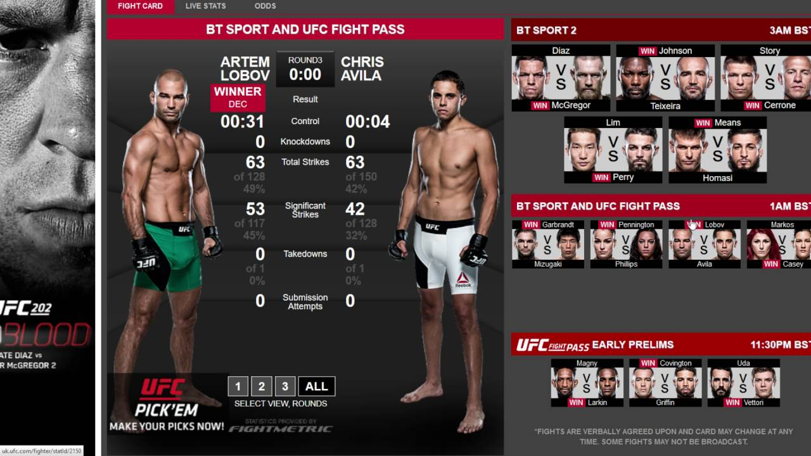
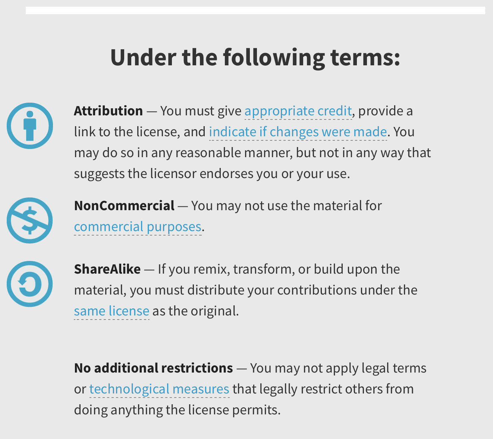

<div style="width: 100%; clear: both;">
<div style="float: left; width: 50%;">

</div>
<div style="float: right; width: 50%;">
<p style="margin: 0; padding-top: 22px; text-align:right;">M2.851 - Tipología y ciclo de vida de los datos aula 1 · Práctica 1</p>
<p style="margin: 0; text-align:right;">2018 · Máster universitario en Ciencia de datos (Data science)</p>
<p style="margin: 0; text-align:right;">Prof. Colaboradora: <b>Laia Subirats Maté</b></p>
<p style="margin: 0; text-align:right; padding-button: 100px;">Alumno: <b>Fernando Antonio Barbeiro Campos</b> - <a href="">fbarbeiro@uoc.edu</a></p>
</div>
</div>
<div style="width:100%;">&nbsp;</div>


### Dataset
Historial de eventos del UFC (*Ultimate Fighting Championship*)
### Descripción
Un dataset completo con todos los eventos deportivos de MMA (*mixed martial arts*) más famoso del mundo, los deportistas, resultados, entre otros.

### Imagen identificativa


<center>Figura 1: Resultados y card de peleas de un evento de UFC.</center> 

### Contexto
El conjunto de datos se trata de todos los eventos deportivos de MMA realizados desde la creación del UFC (primer evento en el **12 de Noviembre de 1993**) hasta el último que ocurrió en el **27 de Octubre de 2018**, o sea, **454 eventos**, bien como el resultado de cada una de las peleas que ocurrieron en cada evento - precisamente **4869 luchas**.

### Contenido
El dataset tiene un contenido bastante sencillo que consiste en:
* [String] *event_name:* Nombre del evento
* [String] *weight_class:* Categoría de peso de la pelea
* [String] *fighter_1:* Nombre del competidor 1
* [String] *action:* Acción que ejecutó el competidor 1 sobre el oponente / resultado
* [String] *fighter_2:* Nombre del oponente
* [Integer] *round:* *Round* en que acabó la lucha
* [String] *time:* Tiempo en el *round* que acabó la lucha
* [String] *method:* Como ha sido el método utilizado para ganar

El intervalo de tiempo fuera mencionado arriba, vale resaltar que en cada evento hay una media de 10.7 luchas. La estrategia utilizada para recoger los datos es el resultado de iteraciones en listas:
* Inicialmente, pillamos la [lista de todos os eventos del UFC](https://en.wikipedia.org/wiki/List_of_UFC_events)
* Hacemos un `for` loop en la lista completa y extraemos (con uso de BeautifulSoup) las URLs individuales de cada evento
* Finalmente también haremos una lectura de tabla para finalmente recolectar los datos.

### Agradecimientos
En análisis se realizó entre **17 y 20 de Octubre** y específicamente el enfoque era encontrar puntos donde pudiera haber ilegalidad en la extracción de información de las fuentes de datos. Para ello, estuve mirando especialmente los ficheros de [robots.txt de Wikipedia](https://en.wikipedia.org/robots.txt), que dicho, es nuestra fuente de información, al cual dejamos el agradecimiento y sugiero donaciones para la iniciativa.
Las URLs de lectura no estaban *Disallowed* en el fichero de Robots, por lo tanto, no habría problemas explorarlas. Aun así, he aplicado técnicas como sleep recomienda **[4] Miller, C. (2017)** para evitar la sobrecarga (*throttling*) de la webpage. 

### Inspiración
Desde mi punto de vista, el conjunto de datos es interesante porque el ámbito de su aplicación es bastante amplio, para comprobar, voy a describir escenarios de su aplicación:

1. Primeramente, una aplicación podría ser para uso en periodismo deportivo - para enseñar datos y patrones del deporte.

2. Un deportista, que compete o no en el evento, podría sacar informaciones de métodos más comúnmente utilizados para encerrar una lucha y, de esa manera, prepararse para evitar que hicieran con él o mismo practicar las técnicas para intentar aplicarlas cuando esté competiendo.

3. La preparación física en un deporte es un punto clave. Entender donde suele pasar la mayor parte de fines de luchas puede también ayudar los profesionales de preparación física a entrenar sus atletas para que en cansancio no les quite la oportunidad de victoria.

4. Podríamos identificar patrones de acuerdo con el peso (categoría) de los atletas, es decir, puede que en una categoría más ligera estén acostumbrados a pelearse más de pie, mientras en otras categorías más pasadas suele ocurrir grappling (lucha de suelo). 

Seguramente hay otras numerosas posibilidades de aplicación.


### Licencia
Haciendo un breve estudio de las licencias presentadas, creo que la que se aplicaría más ampliamente a mi estudio sería **CC BY-NC-SA 4.0**, me explico: la licencia en cuestión permite:
* *Compartir*: copiar y redistribuir el material
* *Adaptar*: transformar y cambiar el material

Sin embargo, no permite el uso comercial del mismo - el que, siendo un trabajo de máster, tiene fines más académicos.

Abajo, una imagen de que trata la licencia elegida:

<center>Figura 2: CC BY-NC-SA 4.0.</center> 

P.D.: Como el los repositorios de Github no había disponibilidad de utilizar la dicha licencia, por allí he definido el uso de **BSD 3-Clause** que básicamente define que las redistribuciones de generadas con base en el proyecto en cuestión deben ser hechas con notificación a priori. Ademas, garantiza que los nombres de los creadores del proyecto inicial no pueden ser usados para promover productos derivados del proyecto inicial.

### Código
En ese apartado, tendremos el código utilizado para la extracción de los datos y al final para la generación del CSV.


```python
import sys
print(sys.version)
```

    3.7.0 (v3.7.0:1bf9cc5093, Jun 26 2018, 23:26:24) 
    [Clang 6.0 (clang-600.0.57)]


```python
# Not necessary at all, but to demonstrate that I'm aware that BeautifulSoup4 must be installed
!{sys.executable} -m pip install --upgrade pip
!{sys.executable} -m pip install BeautifulSoup4
```

    Requirement already up-to-date: pip in /Library/Frameworks/Python.framework/Versions/3.7/lib/python3.7/site-packages (18.1)
    Requirement already satisfied: BeautifulSoup4 in /Library/Frameworks/Python.framework/Versions/3.7/lib/python3.7/site-packages (4.6.3)


```python
from bs4 import BeautifulSoup
from time import sleep
import requests
import pandas as pd
```


```python
Events = []
base_url = 'https://en.wikipedia.org'
main_url = base_url + '/wiki/List_of_UFC_events'
```


```python
def perform_http_get(url):
    r = requests.get(url)
    if r.status_code == 200:
        return BeautifulSoup(r.content, 'html.parser')
        
```


```python
def extract_cell(cells, id_td):
    return cells[id_td].renderContents().decode().strip()
```


```python
def append_fighter_names(cells_event, info):
    fighter1 = ''
    fighter2 = ''
    if len(cells_event[1].findAll('a')) == 0:
        fighter1 = extract_cell(cells_event, 1)
    else:
        fighter1 = cells_event[1].find('a').renderContents().decode().strip()

    if len(cells_event[3].findAll('a')) == 0:
        fighter2 = extract_cell(cells_event, 3)
    else:
        fighter2 = cells_event[3].find('a').renderContents().decode().strip()
    
    info.update({"fighter_1" : fighter1})
    info.update({"fighter_2" : fighter2})
```


```python
def extract_row(cells_event, link):
       
    info = {
        "event_name": link.contents[0],
        "weight_class": extract_cell(cells_event, 0),
        "action": extract_cell(cells_event, 2),
        "method": extract_cell(cells_event, 4),
        "round": extract_cell(cells_event, 5),
        "time": extract_cell(cells_event, 6)
    }
    
    append_fighter_names(cells_event, info)
    Events.append(info)
```


```python
def extract_info_individual_event(link):
    
    individual_event = perform_http_get(base_url + link.get('href'))
    table = individual_event.find('table',{'class': 'toccolours'})
    if table is not None:
        rows_event = table.findAll('tr')

        for row_event in rows_event:
            cells_event = row_event.findAll('td')
            if len(cells_event) > 0 :
                extract_row(cells_event, link)
                        
```


```python
Events = []
soup = perform_http_get(main_url)
table_past_events = soup.find('table', {'id': 'Past_events'})

rows = table_past_events.findAll('tr')

for row in rows:
    sleep(10) # Wait 10 sec, recommendations explained below
    cells = row.findAll('td')
    if len(cells) > 0 :
        links = cells[1].findAll('a')
        for link in links:        
            extract_info_individual_event(link)
```


```python
print(len(Events), ' eventos fueron añadidos')

df = pd.DataFrame(Events)
df = df[['event_name', 'weight_class', 'fighter_1', 'action', 'fighter_2', 'round', 'time', 'method' ]]

df.head(15)
```

    4869  eventos fueron añadidos


<div>
<style scoped>
    .dataframe tbody tr th:only-of-type {
        vertical-align: middle;
    }

    .dataframe tbody tr th {
        vertical-align: top;
    }

    .dataframe thead th {
        text-align: right;
    }
</style>
<table border="1" class="dataframe">
  <thead>
    <tr style="text-align: right;">
      <th></th>
      <th>event_name</th>
      <th>weight_class</th>
      <th>fighter_1</th>
      <th>action</th>
      <th>fighter_2</th>
      <th>round</th>
      <th>time</th>
      <th>method</th>
    </tr>
  </thead>
  <tbody>
    <tr>
      <th>0</th>
      <td>UFC Fight Night: Volkan vs. Smith</td>
      <td>Light Heavyweight</td>
      <td>Anthony Smith</td>
      <td>def.</td>
      <td>Volkan Oezdemir</td>
      <td>3</td>
      <td>4:26</td>
      <td>Submission (rear-naked choke)</td>
    </tr>
    <tr>
      <th>1</th>
      <td>UFC Fight Night: Volkan vs. Smith</td>
      <td>Catchweight (147 lbs)</td>
      <td>Michael Johnson</td>
      <td>def.</td>
      <td>Artem Lobov</td>
      <td>3</td>
      <td>5:00</td>
      <td>Decision (unanimous) (29-28, 29-28, 30-27)</td>
    </tr>
    <tr>
      <th>2</th>
      <td>UFC Fight Night: Volkan vs. Smith</td>
      <td>Light Heavyweight</td>
      <td>Misha Cirkunov</td>
      <td>def.</td>
      <td>Patrick Cummins</td>
      <td>1</td>
      <td>2:40</td>
      <td>Submission (arm-triangle choke)</td>
    </tr>
    <tr>
      <th>3</th>
      <td>UFC Fight Night: Volkan vs. Smith</td>
      <td>Bantamweight</td>
      <td>Andre Soukhamthath</td>
      <td>def.</td>
      <td>Jonathan Martinez</td>
      <td>3</td>
      <td>5:00</td>
      <td>Decision (unanimous) (30-26, 29-28, 29-28)</td>
    </tr>
    <tr>
      <th>4</th>
      <td>UFC Fight Night: Volkan vs. Smith</td>
      <td>Light Heavyweight</td>
      <td>Gian Villante</td>
      <td>def.</td>
      <td>Ed Herman</td>
      <td>3</td>
      <td>5:00</td>
      <td>Decision (split) (29-28, 28-29, 29-28)</td>
    </tr>
    <tr>
      <th>5</th>
      <td>UFC Fight Night: Volkan vs. Smith</td>
      <td>Welterweight</td>
      <td>Court McGee</td>
      <td>def.</td>
      <td>Alex Garcia</td>
      <td>3</td>
      <td>5:00</td>
      <td>Decision (unanimous) (29-28, 29-28, 30-28)</td>
    </tr>
    <tr>
      <th>6</th>
      <td>UFC Fight Night: Volkan vs. Smith</td>
      <td>Welterweight</td>
      <td>Sean Strickland</td>
      <td>def.</td>
      <td>Nordine Taleb</td>
      <td>2</td>
      <td>3:10</td>
      <td>TKO (punches)</td>
    </tr>
    <tr>
      <th>7</th>
      <td>UFC Fight Night: Volkan vs. Smith</td>
      <td>Lightweight</td>
      <td>Nasrat Haqparast</td>
      <td>def.</td>
      <td>Thibault Gouti</td>
      <td>3</td>
      <td>5:00</td>
      <td>Decision (unanimous) (29-27, 29-28, 30-26)</td>
    </tr>
    <tr>
      <th>8</th>
      <td>UFC Fight Night: Volkan vs. Smith</td>
      <td>Featherweight</td>
      <td>Calvin Kattar</td>
      <td>def.</td>
      <td>Chris Fishgold</td>
      <td>1</td>
      <td>4:11</td>
      <td>TKO (punches)</td>
    </tr>
    <tr>
      <th>9</th>
      <td>UFC Fight Night: Volkan vs. Smith</td>
      <td>Women's Bantamweight</td>
      <td>Talita Bernardo</td>
      <td>def.</td>
      <td>Sarah Moras</td>
      <td>3</td>
      <td>5:00</td>
      <td>Decision (unanimous) (30-27, 29-28, 29-28)</td>
    </tr>
    <tr>
      <th>10</th>
      <td>UFC Fight Night: Volkan vs. Smith</td>
      <td>Lightweight</td>
      <td>Don Madge</td>
      <td>def.</td>
      <td>Te'Jovan Edwards</td>
      <td>2</td>
      <td>0:14</td>
      <td>KO (head kick)</td>
    </tr>
    <tr>
      <th>11</th>
      <td>UFC Fight Night: Volkan vs. Smith</td>
      <td>Heavyweight</td>
      <td>Arjan Bhullar</td>
      <td>def.</td>
      <td>Marcelo Golm</td>
      <td>3</td>
      <td>5:00</td>
      <td>Decision (unanimous) (29-28, 29-28, 29-27)</td>
    </tr>
    <tr>
      <th>12</th>
      <td>UFC Fight Night: Volkan vs. Smith</td>
      <td>Lightweight</td>
      <td>Stevie Ray</td>
      <td>def.</td>
      <td>Jessin Ayari</td>
      <td>3</td>
      <td>5:00</td>
      <td>Decision (unanimous) (29-28, 29-28, 30-27)</td>
    </tr>
    <tr>
      <th>13</th>
      <td>UFC 229: Khabib vs. McGregor</td>
      <td>Lightweight</td>
      <td>Khabib Nurmagomedov</td>
      <td>def.</td>
      <td>Conor McGregor</td>
      <td>4</td>
      <td>3:03</td>
      <td>Submission (neck crank)</td>
    </tr>
    <tr>
      <th>14</th>
      <td>UFC 229: Khabib vs. McGregor</td>
      <td>Lightweight</td>
      <td>Tony Ferguson</td>
      <td>def.</td>
      <td>Anthony Pettis</td>
      <td>2</td>
      <td>5:00</td>
      <td>TKO (corner stoppage)</td>
    </tr>
  </tbody>
</table>
</div>


### Dataset: Dataset en formato CSV
Por aquí generamos el dataset que podrá ser consultado en el repositorio.


```python
file_name = 'ufc-events.csv'
df.to_csv(file_name)
```

### Referencias

<p style="text-align: justify">
[1] <b>Subirats, L., Calvo, M. (2018).</b> "<i>Web Scraping</i>". Editorial UOC. Barcelona: Universitat Autònoma de Barcelona.<p>
<p style="text-align: justify">
[2] <b>Masip, D. (?).</b> "<i>El lenguaje Python</i>". Editorial UOC. Barcelona: Universitat Autònoma de Barcelona.<p>
<p style="text-align: justify">
[3] <b>Lawson, R. (2015).</b> "<i>Web Scraping with Python</i>". Packt Publishing Ltd. Chapter 2. Scraping the Data.<p>
<p style="text-align: justify">
[4] <b>Miller, C. (2017).</b> "<i>Data Acquisition and Manipulation with Python - Acquire, Analyse, and Play with Data</i>". Packt Publishing Ltd. Chapter 2. Web Scraping with BeautifulSoup.<p>
    
<p style="text-align: justify">
[5] <b>Chhibber, A. (2018).</b> "<i>Web Scraping Using Python</i>". Technics Publications.<p>
